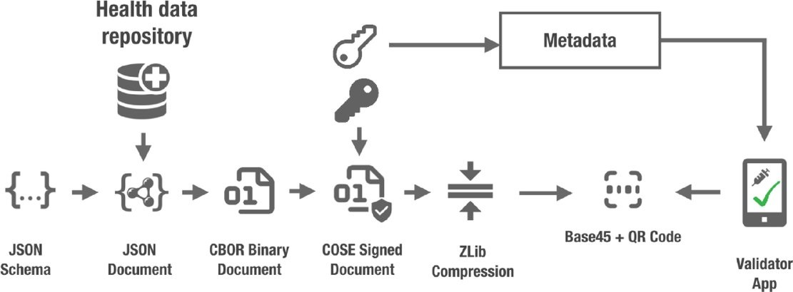

# eEHic

the eEhic will be a showcase in which a customer logs in and creates a profile. Once the profile is create the customer can request an eEhic card. This request will result in a PRC DOCUMENT containing a QR-code which contains exactly the same data which is on the eEhic PRC document written in text. 

On verfication the verifier will scan the QR code on the PRC and verify against EBSI that the issuer is valid and the data is not tampered with. once thse thing are ok the verifier will proceed by showing the eEhic data with which the verifier can see that the identity in the data is the same as that on the pRC and on the identitycard the holder is showing to the verifier. 

